# project1

An E-commerce Flutter App using GetX and Get_storage.

## Login

## Signup
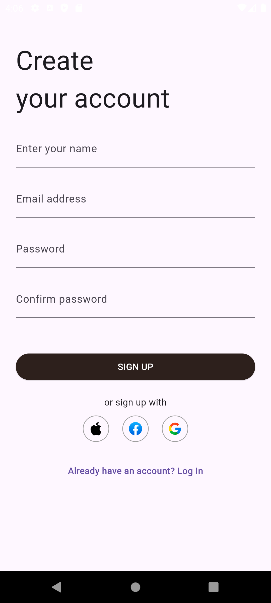

## Home
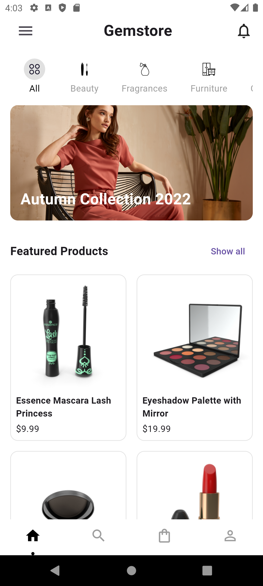

## Sidebar
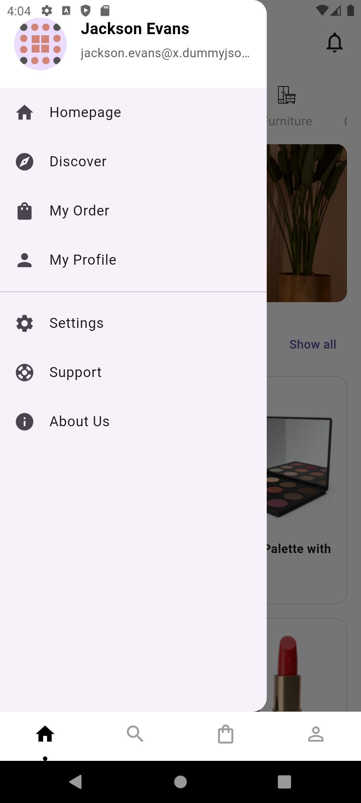

## Filter
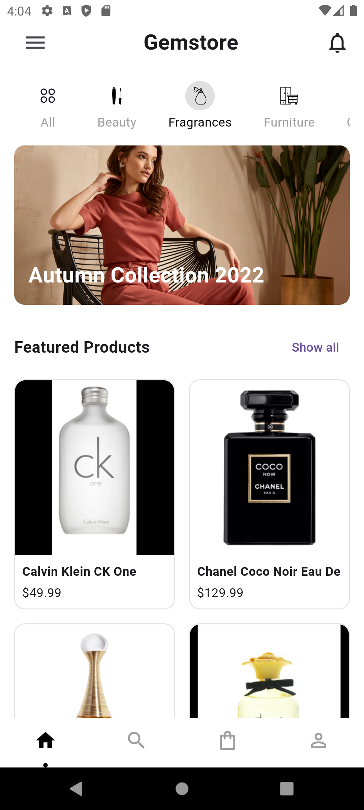

## Search
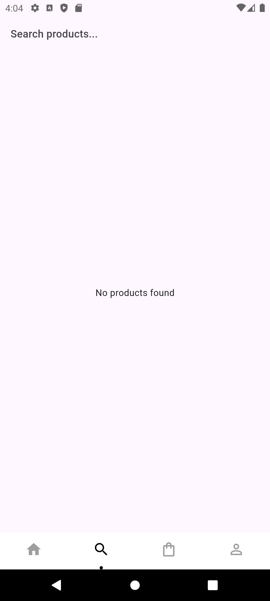

## Result

## Detail

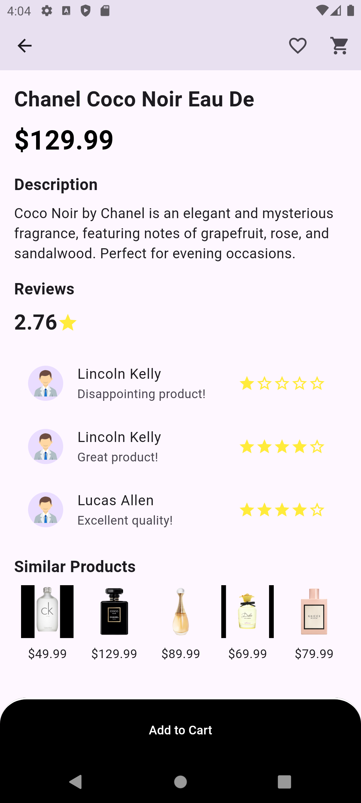

## Cart
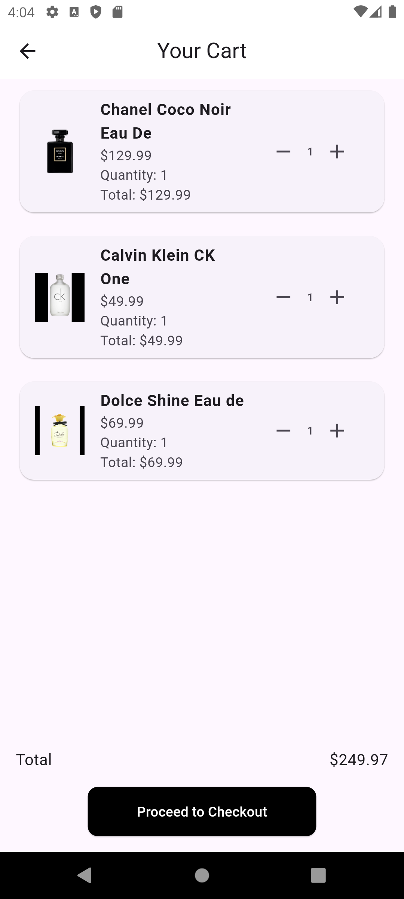

## Shipping
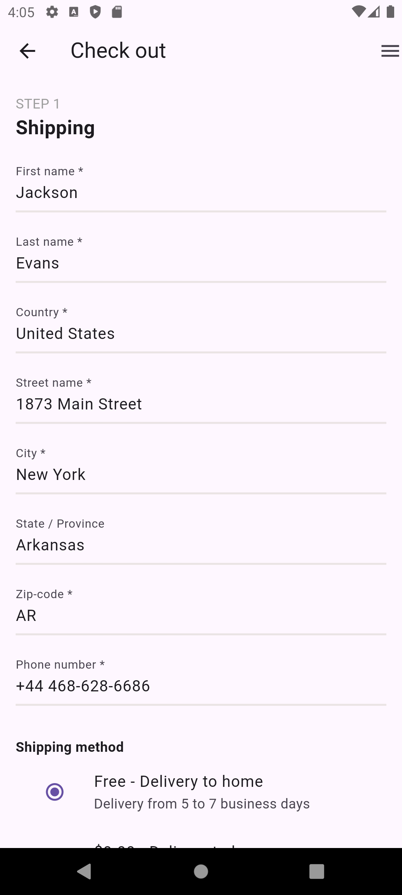
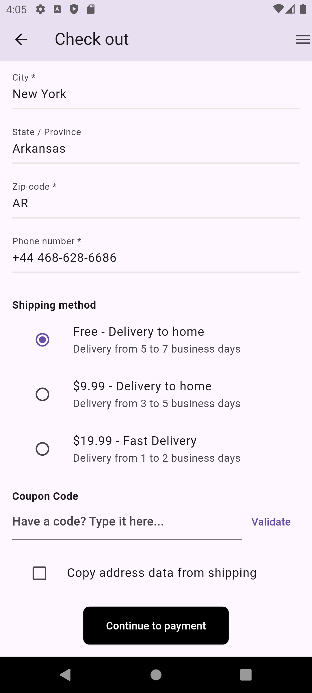

## Payment
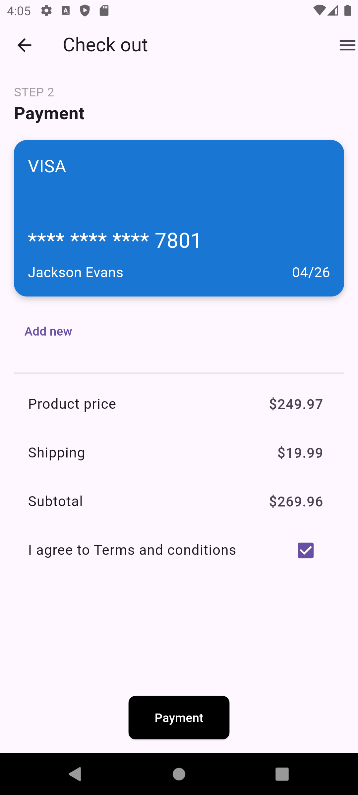

## Completed
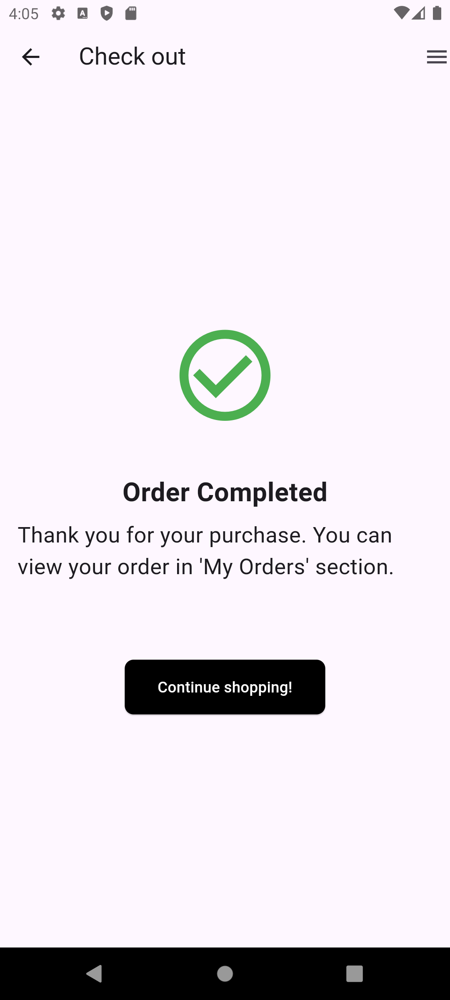

## Setting
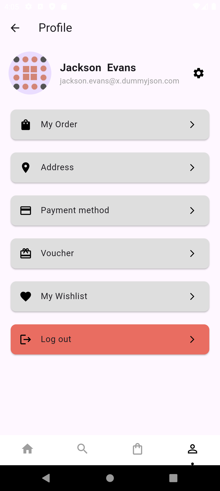

## Profile Setting
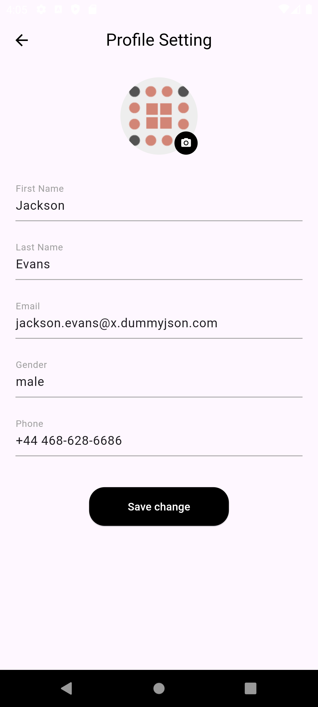

## Order

## Order detail
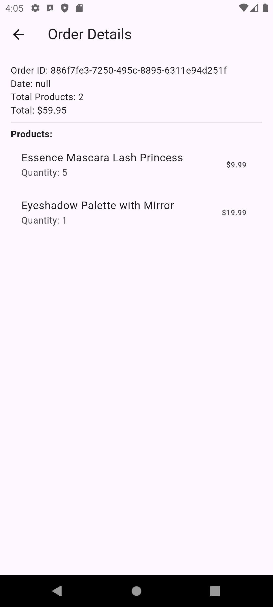

## Pending
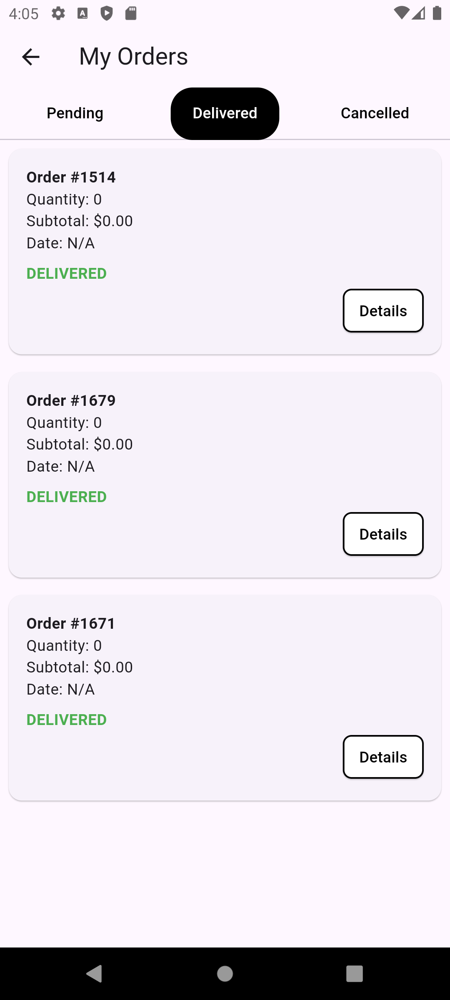

## Canceled
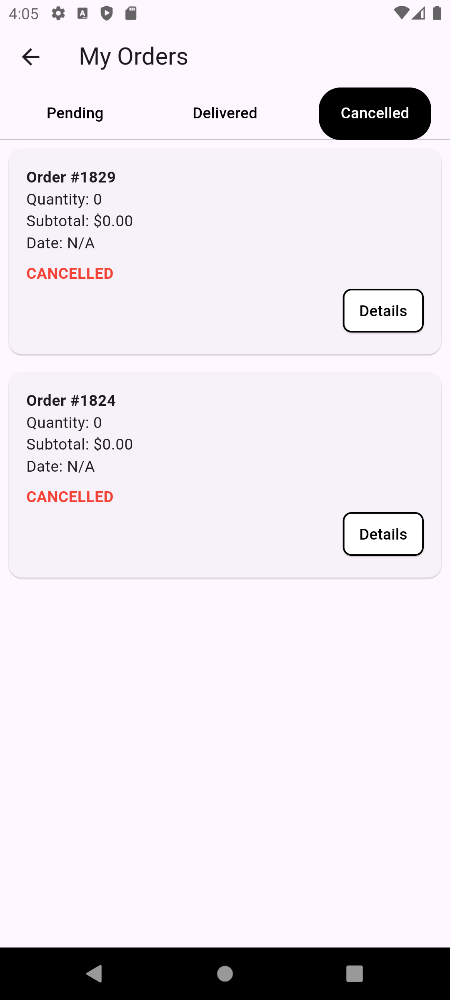
