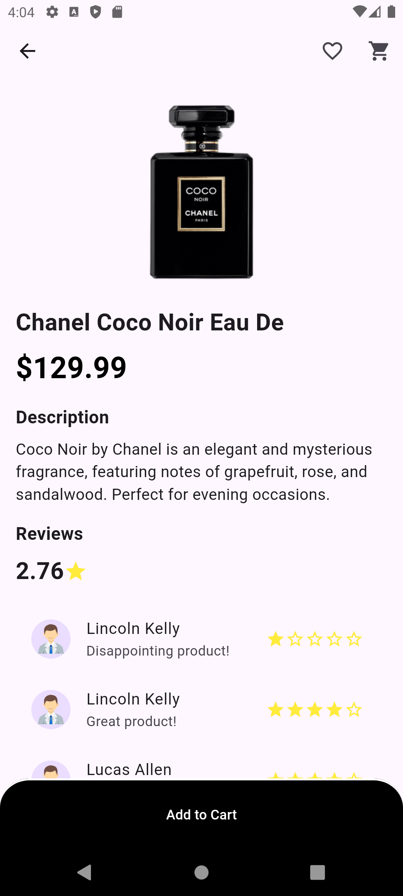
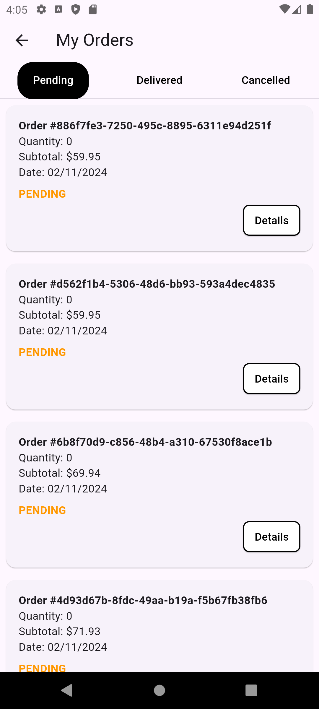

# project1

An E-commerce Flutter App using GetX and Get_storage.

## Login

## Signup

## Home

## Sidebar

## Filter

## Search

## Result

## Detail

## Cart

## Shipping

## Payment

## Completed

## Setting

## Profile Setting

## Order

## Order detail

## Pending

## Canceled

